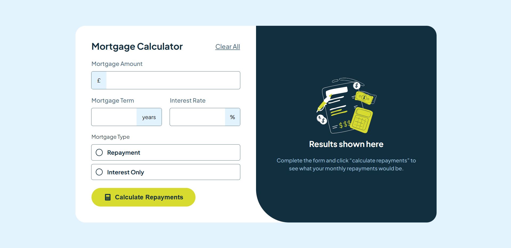

# Frontend Mentor - Mortgage repayment calculator solution

This is a solution to the [Mortgage repayment calculator challenge on Frontend Mentor](https://www.frontendmentor.io/challenges/mortgage-repayment-calculator-Galx1LXK73). Frontend Mentor challenges help you improve your coding skills by building realistic projects.

## Table of contents

- [Frontend Mentor - Mortgage repayment calculator solution](#frontend-mentor---mortgage-repayment-calculator-solution)
  - [Table of contents](#table-of-contents)
  - [Overview](#overview)
    - [The challenge](#the-challenge)
    - [Screenshot](#screenshot)
    - [Links](#links)
  - [My process](#my-process)
    - [Built with](#built-with)
    - [What I learned](#what-i-learned)
    - [Continued development](#continued-development)
    - [Useful resources](#useful-resources)
  - [Author](#author)
  - [Acknowledgments](#acknowledgments)

## Overview

### The challenge

Users should be able to:

- Input mortgage information and see monthly repayment and total repayment amounts after submitting the form
- See form validation messages if any field is incomplete
- Complete the form only using their keyboard
- View the optimal layout for the interface depending on their device's screen size
- See hover and focus states for all interactive elements on the page

### Screenshot



### Links

- Solution URL: [github.com](https://github.com/sudarshanHosalli/Mortgage-repayment-calculator)
- Live Site URL: [live site](https://mortgage-r-calculator.netlify.app/)

## My process

### Built with

- Semantic HTML5 markup
- CSS custom properties
- Flexbox
- CSS Grid
- Mobile-first workflow

### What I learned

Working on this project helped me better understand form validation and dynamic content rendering in JavaScript. Below are some examples of the code I used:

```html
<!-- Example of a form input -->
<input type="number" id="loanAmount" placeholder="Enter loan amount" required />
```

```css
/* Styling the results container */
.results-container {
  padding: 1rem;
  background-color: #f9f9f9;
  border-radius: 8px;
}
```

```js
// Example of a function to calculate monthly repayments
function calculateMonthlyRepayments(principal, rate, term) {
  const monthlyRate = rate / 12 / 100;
  const numberOfPayments = term * 12;
  return (
    (principal * monthlyRate) / (1 - Math.pow(1 + monthlyRate, -numberOfPayments))
  ).toFixed(2);
}
```

### Continued development

In future projects, I want to focus on:

- Enhancing accessibility features for all users.
- Optimizing code for better performance on larger datasets.
- Exploring additional CSS methodologies for improved maintainability.

### Useful resources

- [MDN Web Docs](https://developer.mozilla.org/) - Comprehensive documentation that helped me understand form validation.
- [CSS Tricks](https://css-tricks.com/) - Great resource for CSS tips and best practices.
- [Frontend Mentor](https://www.frontendmentor.io/) - For challenges and inspiration.

## Author

- Frontend Mentor - [@sudarshanHosalli](https://www.frontendmentor.io/profile/sudarshanHosalli)
- GIthub - [@sudarshanHosalli](https://github.com/sudarshanHosalli)

## Acknowledgments

I would like to thank the Frontend Mentor community for providing feedback and inspiration. Special thanks to [Contributor Name] for their guidance on improving my JavaScript code.

